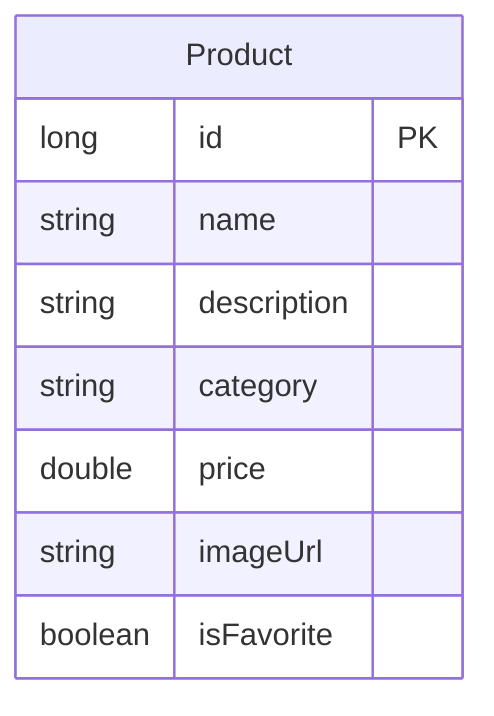

# Схема базы данных

## Диаграмма сущностей



## Описание таблиц

### Таблица products
Хранит информацию о товарах в аптеке.

| Колонка | Тип | Описание |
|---------|-----|----------|
| id | LONG | Первичный ключ |
| name | TEXT | Название товара |
| description | TEXT | Описание товара |
| category | TEXT | Категория товара |
| price | REAL | Цена товара |
| imageUrl | TEXT | URL изображения товара |
| isFavorite | BOOLEAN | Флаг "в избранном" |

## Индексы

```sql
CREATE INDEX idx_product_category ON products(category);
CREATE INDEX idx_product_name ON products(name);
```

## Примечания по реализации

1. **Room Database**
   - Используется Room для работы с SQLite
   - Автоматическая миграция при изменении схемы

2. **Доступ к данным**
   - ProductDao для операций с базой данных
   - Поддержка Flow для реактивных обновлений
   - Кэширование данных для офлайн-режима

3. **Основные операции**
   - Получение всех товаров
   - Поиск по названию и описанию
   - Управление избранными товарами
   - Получение товара по ID
