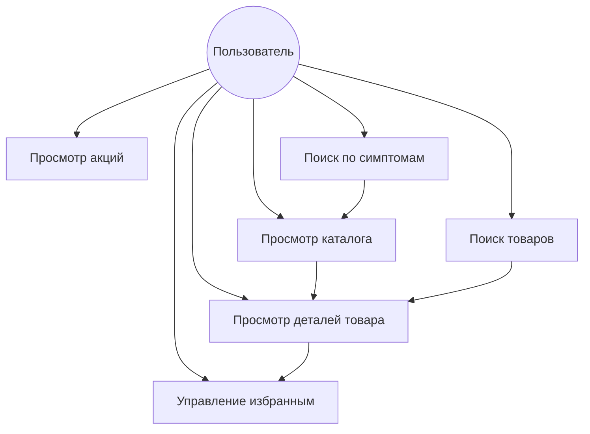

# Функциональные требования

## Диаграмма вариантов использования

## Пользовательские истории

### 1. Просмотр каталога
**Как** пользователь  
**Я хочу** просматривать доступные аптечные товары  
**Чтобы** найти нужный мне товар

**Критерии приемки:**
- Товары отображаются в виде прокручиваемого списка
- Каждый товар показывает: название, цену и изображение
- Возможность перехода к детальной информации о товаре

### 2. Поиск товаров
**Как** пользователь  
**Я хочу** искать конкретные товары  
**Чтобы** быстро находить нужные мне товары

**Критерии приемки:**
- Поисковая строка легко доступна
- Результаты поиска обновляются в реальном времени
- Поиск работает по названию товара
- Отображается сообщение, если ничего не найдено

### 3. Просмотр деталей товара
**Как** пользователь  
**Я хочу** видеть подробную информацию о товаре  
**Чтобы** принять решение о его выборе

**Критерии приемки:**
- Полное описание товара
- Информация о цене
- Возможность добавить в избранное
- Изображение товара

### 4. Управление избранным
**Как** пользователь  
**Я хочу** сохранять товары в избранное  
**Чтобы** быстро находить их позже

**Критерии приемки:**
- Добавление товаров в избранное
- Удаление товаров из избранного
- Просмотр списка избранных товаров
- Переход к деталям товара из списка избранного

### 5. Просмотр акций
**Как** пользователь  
**Я хочу** видеть текущие акции и предложения  
**Чтобы** найти выгодные предложения

**Критерии приемки:**
- Отображение баннеров с акциями
- Описание условий акций
- Изображения для акций

### 6. Поиск по симптомам
**Как** пользователь  
**Я хочу** искать лекарства по симптомам  
**Чтобы** найти подходящее лечение

**Критерии приемки:**
- Список основных симптомов
- Быстрый переход к поиску по симптому
- Отображение релевантных товаров

## Технические требования

1. **Хранение данных**
   - Локальная база данных для хранения товаров
   - Кэширование данных
   - Синхронизация с сервером

2. **Сетевые операции**
   - Интеграция с REST API
   - Обработка ошибок сети
   - Поддержка офлайн-режима

3. **Пользовательский интерфейс**
   - Компоненты Material Design 3
   - Адаптивные макеты
   - Поддержка светлой/темной темы
   - Состояния загрузки и ошибок

4. **Производительность**
   - Быстрый запуск приложения
   - Плавная прокрутка списков
   - Эффективная загрузка изображений
   - Фоновая обработка тяжелых операций 